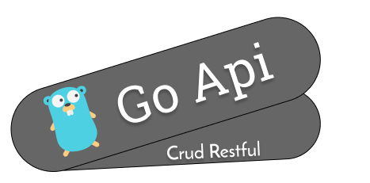

<h1 align="center">
      
</h1>

<h3 align="center">
  Go Rest Api
</h3>

A simple API to test native http packages from Golang 🎓

Made with Golang and PostgreSQL 🚀

Using Docker 🐳

  

  

  

  

  <a href="#-installation-and-execution">Installation and execution</a>&nbsp;&nbsp;&nbsp;|&nbsp;&nbsp;&nbsp;
  <a href="#-available-routes">Available Routes</a>&nbsp;&nbsp;&nbsp;|&nbsp;&nbsp;&nbsp;
  <a href="#-how-to-contribute">How to contribute</a>&nbsp;&nbsp;&nbsp;|&nbsp;&nbsp;&nbsp;

## 🚀 Installation and execution

1. Clone this repository and go to the directory;
2. Rename .env.sample to .env;

<h4> 🔧 Development </h4>

1. Run `docker-compose up`;
2. Make the Requests;

<h4> 🧪 Tests </h4>

1. Run `docker-compose -f docker-compose.test.yml up --build --abort-on-container-exit`;

## 🛣️ Available Routes

<h4> POST </h4>

- '/stores'

<h4> PUT </h4>

- '/stores/{id:[0-9]+}'

<h4> DELETE </h4>

- '/stores/{id:[0-9]+}'

<h4> GET </h4>

- '/stores'

- '/stores/{id:[0-9]+}'

## 🤔 How to contribute

- Fork this repository;
- Create a branch with your feature: `git checkout -b my-feature`;
- Commit your changes: `git commit -m 'feat: My new feature'`;
- Push to your branch: `git push origin my-feature`.

After the merge of your pull request is done, you can delete your branch.

---